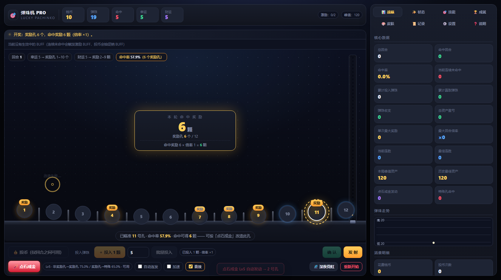
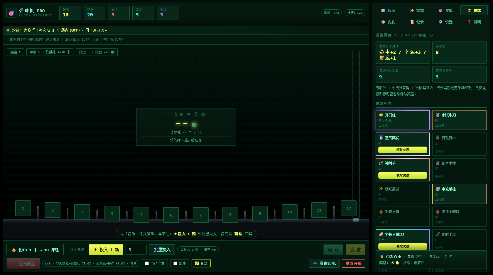
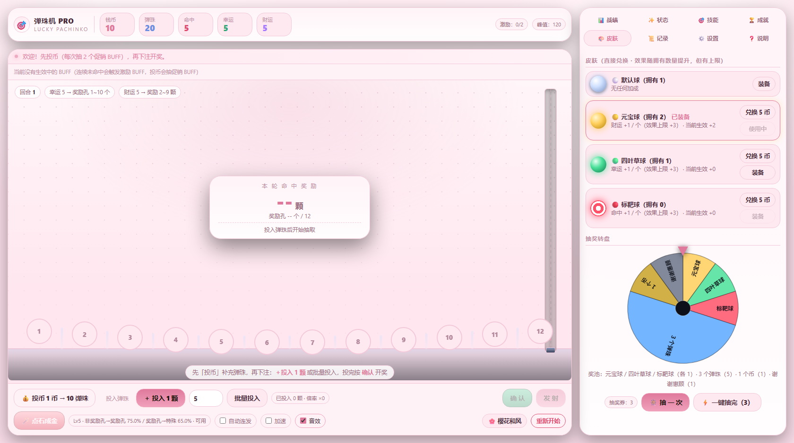
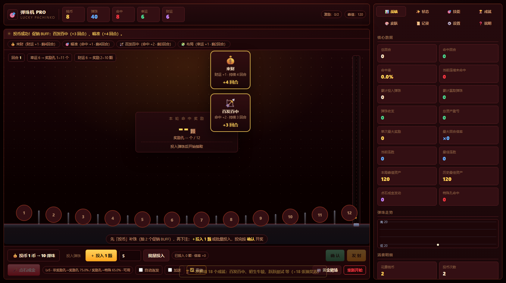
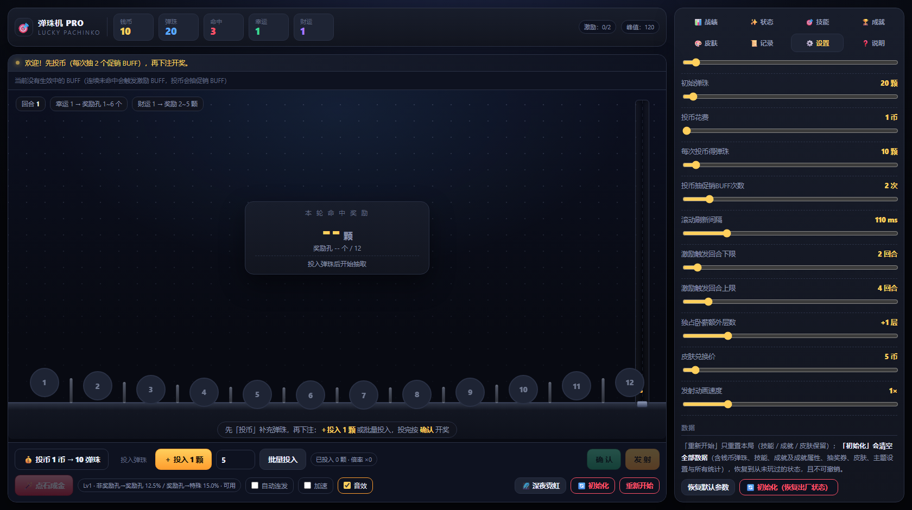

# 🎯 弹珠机 PRO · 幸运打珠

> 一个**纯前端、零依赖、单文件**的日式弹珠机（Pachinko）模拟游戏。
> 投入弹珠 → 确认开奖 → 瞄准奖励孔 → 拉动发射机构，在弹珠耗尽前把总资产做大。

**在线试玩：** `https://<你的用户名>.github.io/<仓库名>/marble-pachinko.html`
（把这段换成你自己的 GitHub Pages 地址；若已把文件重命名为 `index.html`，直接访问仓库根路径即可）



---

## ✨ 特性一览

| 模块 | 内容 |
|---|---|
| 🎰 真实发射机构 | 斜坡准备区 → 隔板开启 → 弹珠流入发射槽 → 击打装置击发 → 上行越顶 → 落入命中孔 → 掉回斜坡，全程动画 + 皮肤色尾迹 |
| 🎨 5 套主题 | 深夜霓虹 / 明亮日间 / 复古街机 / 樱花和风 / 黄金赌场；不只换色，圆角、间距、字体、栏宽、孔形、扫描线一并切换 |
| 📊 三属性养成 | 命中 / 幸运 / 财运，来源可追溯（激励 BUFF + 促销 BUFF + 成就 + 技能 + 皮肤） |
| 🎯 技能加点 | 三系被动技能 + 特殊技能「点石成金」，加点**下回合生效** |
| 🏆 46 个成就 | 8 档稀有度描边（含流动金/红白/红橙/彩虹），手动领奖，每解锁 1 个送 1 次抽奖 |
| 🎨 皮肤 & 转盘 | 4 款皮肤（可兑换/可抽到，效果随持有量提升但有上限）+ 权重转盘、一键抽完 |
| 💾 本地存档 | localStorage 自动保存，区分「本局进度」与「永久档案」 |
| 📱 响应式 | 窄屏自动变单列布局 |

零依赖、零构建、可离线：没有 CDN、没有外链字体、没有音频文件（音效由 WebAudio 现场合成）。

---

## 🎮 怎么玩

### 一个回合的完整流程

```
① 投币补珠（仅回合之间可投）
        ↓
② 投入弹珠（可连续投 / 批量投）  ← 倍率 = 本回合累计投入颗数
        ↓
③ 按「确认」开奖：先按幸运表抽「奖励孔数量」，再从 12 个孔随机点亮；
                 再按财运表抽一个统一的「命中奖励」数字，显示在面板正中间
        ↓
④ 点一个孔瞄准（可选：用「点石成金」改造它）
        ↓
⑤ 按「发射」→ 弹珠走完发射机构动画 → 落在任意奖励孔即中奖
```

### 中奖结算

```
获得弹珠 = 命中奖励 × 本回合倍率 × (特殊奖励孔 ? 2 : 1) + 额外奖励（卧薪尝胆层数等）
```

* 只要落在**任意一个**奖励孔就中奖，不要求正中瞄准的那个孔。
* 单回合投入 1 颗 → ×1；再投 3 颗共 4 颗 → ×4。
* 命中奖励最低 2 颗（财运表第 1 列权重恒为 0），所以投 1 颗进洞必定不亏。

### 命中率怎么算

```
每孔基础权重 = 1
所选孔权重   = 1 + 命中属性
左右邻孔     = 2（各 +1），边孔只有一个邻孔

命中率 = 全部奖励孔的权重之和 ÷ 12 个孔的权重总和
       分母 = 12 + 命中 + 邻孔数（中间孔 2 / 边孔 1）
```

> 实测示例：奖励孔为 3/5/6/9 号、命中 0 时，瞄 4 号孔 → 6/14 = **42.9%**（因为它的左右邻孔都是奖励孔）；
> 瞄 10 号孔 → 4/13 = 30.8%。所以「命中」属性只在**瞄到奖励孔**时才划算。

### 操作

| 操作 | 说明 |
|---|---|
| 💰 投币 | 1 币 → 10 弹珠，同时抽 2 个促销 BUFF；**仅回合之间可用** |
| ＋ 投入 1 颗 / 批量投入 | 可反复投，倍率累加 |
| 确 认 | 停止滚动、正式开奖 |
| 🪄 点石成金 | 确认后、发射前可用，改造当前选中的孔 |
| 发 射 | 走机构动画并结算 |
| 空格键 | 下注 / 确认 / 发射（按阶段自动判断） |
| 自动连发 / 加速 / 音效 | 挂机与节奏控制 |

---

## 📐 核心数值

### 权重表

<details>
<summary><b>幸运 → 奖励孔个数权重</b>（列 = 1~12 个孔；幸运上限 20）</summary>

```
 0: 1 1 1 1 1 0 0 0 0 0 0 0
 1: 1 2 2 2 2 1 0 0 0 0 0 0
 2: 1 2 3 3 3 2 1 0 0 0 0 0
 3: 1 2 3 4 4 3 2 1 0 0 0 0
 4: 1 2 3 4 5 4 3 2 1 0 0 0
 5: 1 2 3 4 5 5 4 3 2 1 0 0
 6: 1 2 3 4 5 5 5 4 3 2 1 0
 7: 1 2 3 4 5 5 5 5 4 3 2 1
 8: 1 2 3 4 5 5 5 6 5 4 3 2
 9: 1 2 3 4 5 5 5 7 6 5 4 3
10: 1 2 3 4 5 5 5 7 7 6 5 4
11: 1 2 3 4 5 5 5 7 8 7 6 5
12: 1 2 3 4 5 5 5 7 8 8 7 6
13: 1 2 3 4 5 5 5 7 8 8 8 7
14: 1 2 3 4 5 5 5 7 8 8 8 8
15: 1 2 3 4 5 5 5 6 8 8 8 9
16: 1 1 2 3 4 4 4 5 8 8 8 9
17: 1 1 1 2 3 3 3 4 8 8 8 9
18: 0 1 1 1 2 2 2 3 7 8 8 9
19: 0 0 1 1 1 1 1 2 7 9 9 10
20: 0 0 0 1 1 1 1 1 7 10 10 11
```

默认（幸运 0）只可能开出 **1~5 个**奖励孔，6 个以上要靠幸运属性解锁。
</details>

<details>
<summary><b>财运 → 命中奖励权重</b>（列 = 1~15 颗；财运上限 20）</summary>

```
 0: 0 1 1 1 0 0 0 0 0 0 0 0 0 0 0
 1: 0 1 2 2 1 0 0 0 0 0 0 0 0 0 0
 2: 0 1 2 3 2 1 0 0 0 0 0 0 0 0 0
 3: 0 1 2 3 3 2 1 0 0 0 0 0 0 0 0
 4: 0 1 2 3 4 3 2 1 0 0 0 0 0 0 0
 5: 0 1 2 3 4 4 3 2 1 0 0 0 0 0 0
 6: 0 1 2 3 4 5 4 3 2 1 0 0 0 0 0
 7: 0 1 2 3 4 5 5 4 3 2 1 0 0 0 0
 8: 0 1 2 3 4 5 5 5 4 3 2 1 0 0 0
 9: 0 1 2 3 4 5 5 5 5 4 3 2 1 0 0
10: 0 1 2 3 4 5 5 5 5 5 4 3 2 1 0
11: 0 1 2 3 4 5 5 5 5 5 5 4 3 2 1
12: 0 1 2 3 4 5 5 5 5 5 5 5 4 3 2
13: 0 1 2 3 4 5 5 5 5 5 5 5 5 4 3
14: 0 1 2 3 4 5 5 5 5 5 5 5 5 5 4
15: 0 1 2 3 4 5 5 5 5 5 5 5 5 5 6
16: 0 1 1 2 3 4 4 5 5 5 5 5 5 5 6
17: 0 1 1 1 2 3 3 4 4 5 5 5 5 6 7
18: 0 0 1 1 1 2 2 3 3 4 4 6 6 7 8
19: 0 0 0 1 1 1 1 2 2 3 3 6 6 8 9
20: 0 0 0 0 1 1 1 1 1 2 2 7 7 9 10
```

默认（财运 0）只可能抽到 **2~4 颗**，5 颗以上要靠财运属性解锁。
</details>

### 属性来源与上限

| 属性 | 作用 | 上限 |
|---|---|---|
| **命中** | 所选孔权重 +N（邻孔恒 +1） | **无上限** |
| **幸运** | 决定奖励孔个数（查上表） | 20 |
| **财运** | 决定命中奖励数字（查上表） | 20 |

属性总值 = 激励 BUFF + 促销 BUFF + 成就奖励 + 技能等级 + 皮肤加成（面板「✨ 状态」页有逐项明细）。

---

## 🧩 系统详解

### 🎯 技能加点（消耗弹珠，**下回合生效**）

| 技能 | 效果 | 升级消耗（Lv0→5） |
|---|---|---|
| 命中 | 每级 +1 命中 | 100 / 200 / 300 / 400 / 500 |
| 幸运 | 每级 +1 幸运 | 100 / 200 / 300 / 400 / 500 |
| 财运 | 每级 +1 财运 | 100 / 200 / 300 / 400 / 500 |
| 🪄 点石成金 | 见下 | 250 / 500 / 750 / 1000 / 1500 |

**点石成金**：在「确认」之后、发射之前，改造当前选中的孔一次。

| 等级 | 非奖励孔 → 奖励孔 | 奖励孔 → 特殊奖励孔（命中奖励 ×2） |
|---|---|---|
| 1 | 12.5% | 15% |
| 2 | 25% | 25% |
| 3 | 40% | 35% |
| 4 | 60% | 45% |
| 5 | 75% | 65% |

* 发动时有「光点汇聚 → 光环扩散 → 结果文字」的动画，成功/失败都有反馈。
* **Lv5 额外效果**：每回合按「确认」时会自动对随机一个孔再发动一次 5 级点石成金。

### ✨ 激励 BUFF（连续未命中触发的补偿机制）

连续 **2~4** 回合（开局随机一个阈值，每次触发后重新随机）未命中奖励孔，就随机获得 1 种，**命中一次奖励孔后全部消失**：

| BUFF | 效果 |
|---|---|
| 🎯 命中加成 | 命中 +1 |
| 🧩 广撒网 | 幸运 +1 |
| 💰 聚宝盆 | 财运 +1 |
| 🔥 卧薪尝胆 | 命中后额外获得「层数」颗弹珠（不显示在中间奖励数字上） |

* 同一个 BUFF 不会重复获得；已集齐 4 种则改为 +1 层卧薪尝胆。
* 身上**没有任何激励 BUFF** 时抽到卧薪尝胆，会额外多给 1 层（共 2 层）。

### 🏦 促销 BUFF（每次投币抽 2 次，可重复获得）

每次投币随机抽 2 次，重复获得**只延长时间、加成不叠加**，单条最长 10 回合：

| BUFF | 效果 | 持续 |
|---|---|---|
| 💰 来财 | 财运 +1 | 2~5 回合 |
| 🏦 财源广进 | 财运 +2 | 2~3 回合 |
| 🎯 瞄准 | 命中 +1 | 2~5 回合 |
| 🏹 百发百中 | 命中 +2 | 2~3 回合 |
| 🧩 布局 | 幸运 +1 | 2~5 回合 |
| 📜 谋略 | 幸运 +2 | 2~3 回合 |

获得时会弹出**小卡片**（图标 / 名称 / 效果 / +N 回合），随后缩小飞入顶部 BUFF 栏。

### 🏆 成就（46 个）

8 档稀有度描边：灰（未解锁）/ 铜 / 银 / **流动金** / **红白流动** / **红橙流动** / **彩虹流动** / 紫（特殊）。
解锁后进入「🏆 成就」页**手动领取**奖励（币 或 属性点），并自动获得 **1 张抽奖券**。
鼠标悬停或点击卡片，面板**底部固定详情条**会显示解锁条件、奖励与状态（成就统计为终身累计，跨局保留）。

| 系列 | 内容 |
|---|---|
| 紫（特殊） | 开门红、尊贵的顾客、第一次、重头再来 |
| 连击 | 小试牛刀 3、意气风发 5、百发百中 7、神射手 10 / 15 / 20 / 25 |
| 累计命中 | 初生牛犊 5、跃跃欲试 10、中流砥柱 20、坚持不懈 30 / 50 / 100 |
| 大满贯 | 单回合赢取 10 / 20 / 30 / 50 / 100 / 150 颗 |
| 消费 | 客人 5 币、老板 12、大老板 25、财阀 50、富可敌国 100 |
| 投入 | 有来有回 20、有去无回 50、弹珠还够吗 150、赌博可耻 300、回本 750、财富五车 2000 |
| 资本 | 小资本 500、大资本 1000、大财阀 3000、财力雄厚 8000、独霸一方 20000、富可敌国 100000（累计获得弹珠） |
| 豪赌 | 赌狗 10、赌徒 50、赌神 500、梭哈 2000 / 5000 / 20000（单回合投入） |

### 🎨 皮肤与抽奖

| 皮肤 | 效果（每个 +1，效果上限 +3） |
|---|---|
| ⚪ 默认球 | 无加成 |
| 🟡 元宝球 | 财运 +1 / 个 |
| 🟢 四叶草球 | 幸运 +1 / 个 |
| 🔴 标靶球 | 命中 +1 / 个 |

皮肤可花币直接兑换，也能从转盘抽到；装备后发射的弹珠外观与尾迹颜色都会变化。

**转盘奖池**（权重）：

| 奖励 | 权重 |
|---|---|
| 元宝球 / 四叶草球 / 标靶球 | 各 1 |
| 3 个弹珠 | 5 |
| 1 个币 | 1 |
| 谢谢惠顾 | 1 |

支持「抽一次」与「⚡ 一键抽完」（一次消耗全部抽奖券并列出汇总）。

### 🎨 主题

| 主题 | 风格 |
|---|---|
| 🌌 深夜霓虹 | 深蓝夜色 + 金色高光（默认） |
| ☀️ 明亮日间 | 浅色日间模式 |
| 👾 复古街机 | CRT 绿 + 等宽字体 + 直角 + 扫描线 |
| 🌸 樱花和风 | 粉白柔和 + 大圆角 |
| 🎰 黄金赌场 | 暗红鎏金 + 硬朗描边 |

在「⚙️ 设置」里选择，或用控制栏的「🎨 主题」按钮循环切换；主题会一并改变圆角、间距、字体、右栏宽度等布局参数。





---

## 🛠 本地运行 / 部署

**本地**：直接双击 `marble-pachinko.html` 即可，无需服务器与构建。

**GitHub Pages**：

1. 把 `marble-pachinko.html`（连同 `screenshots/`，否则 README 里的图会裂）提交到仓库；
2. 仓库 `Settings → Pages → Build and deployment` 选择 `Deploy from a branch`，分支选 `main`、目录选 `/ (root)`，保存；
3. 等 1~2 分钟后访问 `https://<用户名>.github.io/<仓库名>/marble-pachinko.html`。

> 💡 想让根路径 `https://<用户名>.github.io/<仓库名>/` 直接打开游戏，把文件复制/重命名为 `index.html` 即可（两份都留也可以）。

---

## 📁 目录结构

```
.
├── marble-pachinko.html     # 游戏本体（单文件：HTML + CSS + JS，约 110 KB，无外部依赖）
├── screenshots/             # README 用截图
│   ├── 01-board-neon.png
│   ├── 02-achievements-arcade.png
│   ├── 03-skins-lottery-sakura.png
│   ├── 04-buff-cards-vegas.png
│   └── 05-init-button.png
└── README.md
```

---

## 💾 存档说明

数据全部存在浏览器 localStorage，分两个键：

| 键 | 内容 | 清除方式 |
|---|---|---|
| `marble-pachinko-pro-v3` | 本局进度（钱币/弹珠/奖励孔/日志/走势） | 控制栏「重新开始」 |
| `marble-pachinko-profile-v1` | 永久档案（技能等级 / 成就 / 成就属性 / 皮肤 / 抽奖券 / 主题 / 终身统计） | 控制栏「🔄 初始化」 |

* **重新开始**：只重置本局，技能、成就、皮肤、抽奖券全部保留。
* **🔄 初始化**（控制栏与「⚙️ 设置 → 数据」各有一个）：**清空全部数据并恢复出厂状态** —— 钱币弹珠、本局记录与走势、四系技能等级、46 个成就及已领取的成就属性、抽奖券与抽奖次数、所有皮肤、主题/音效/加速设置、终身统计全部归零，等同于第一次打开游戏。执行前有明确二次确认，不可撤销。



> 无痕模式或清理浏览器数据会丢失存档；不同浏览器/设备之间不互通。

---

## 🌐 浏览器兼容

需要支持 Web Animations API、CSS 变量、`backdrop-filter`、`color-mix()` 的现代浏览器：

| 浏览器 | 版本 |
|---|---|
| Chrome / Edge | 111+ |
| Safari | 16.2+ |
| Firefox | 113+ |

窄屏（< 1240px）会自动切换成单列布局。音效由 WebAudio 实时合成，可随时关闭。

---

## 📄 声明

个人练习 / 娱乐向项目，纯前端实现，无任何真实货币、充值或联网功能。游戏内「钱币」「弹珠」均为虚拟数值，仅用于模拟弹珠机的概率与运营机制。
